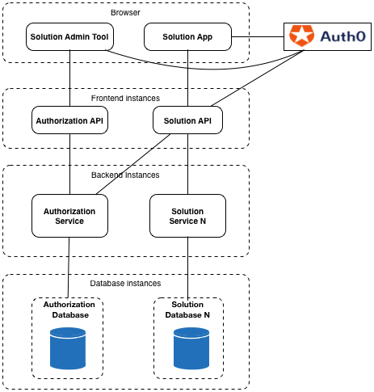

# labs-authorization

A full-stack component providing authorization functionality, designed for use in Labs projects.

## Node installation

There are 4 package.json files present in the repository (root, component, service and api), each requiring an npm install if the full stack is to be run.

## Database

Running the initial demo (first cut of the service) uses Postgres in a Docker running instance, which can be created with:

```
npm run pg:build
```

Note: In case you have issues building or running it with Docker make sure you have a recent version of docker engine and docker compose.

###Start Postgres in a Docker container

A Docker container with Postgres can be started with:
```
npm run pg:start
```

To see the running container and its ID:
```
docker ps
```

To connect to the running container:
```
docker exec -ti <container_id> <command>
```
e.g.
```
docker exec -ti e343edecaaa7 ls
docker exec -ti e343edecaaa7 bash
docker exec -ti e bash        // short container name
```

###Populate the database

The Authorization database, system user and initial tables
can be created by executing:

```
npm run pg:init
```

Test data can be added with:
```
npm run pg:load-test-data
```

###pgAdmin database access
As the Postgresql docker container has its 5432 port forwarded on the local machine the database can be accessed with pgAdmin.

To access the database using the pgAdmin you have to fill in also the container IP beside the database names and access credentials. The container IP can be seen with `docker ps`.


## Service

The service will respond to commands such as a list users request:

    {role: 'authorization', cmd: 'list', type: 'users'}

with data in the form:

    [ { id: 1, name: 'Charlie Bucket' },
      { id: 2, name: 'Grandpa Joe' },
      { id: 3, name: 'Veruca Salt' },
      { id: 4, name: 'Willy Wonka' } ]

It also has a shutdown operation, which should be called when finished with the
service:

    {role: 'authorization', cmd: 'done'}

## API

An example API route for fetching all the users is: http://localhost:8000/authorization/users

Curl examples for all the routes can be found in api/route.js

Swagger documentation can be found once the API is running by visiting: http://localhost:8000/documentation

To expose the routes start both the service and the API with the following:

    npm run start:service

    npm run start:api

## Frontend

To build the frontend

    cd component && npm run build

And then in the root directory

    npm run start:component

## Testing

Tests are supplied for the service interface and the Hapi wiring (npm test).

The test data in the database are going to be reloaded when running `npm test` form the project root.

## Security

Please ignore any security bad practices at the minute, as the security stories have not yet been implemented

### ENV variables to set configuration options

`service` and `api` have a default configuration in their `config.js` files ([`api/lib/config.js`](https://github.com/nearform/labs-authorization/blob/master/api/lib/config.js) and [`service/lib/config.js`](https://github.com/nearform/labs-authorization/blob/master/service/lib/config.js)).

This configuration is the one used in dev environment and we are quite sure the production one will be different :) To override this configuration you can use ENV variables on the server/container/machine you will run the app(s) on.

Both `api` and `service` will have a different prefix ([api](https://github.com/nearform/labs-authorization/blob/master/api/lib/config.js#L20) , [service](https://github.com/nearform/labs-authorization/blob/master/service/lib/config.js#L29)) for their config ovirride ENV variables:

Some example:

```
# api config

{
  server: {
    port: 8000
  }
}

# env variable override

LABS_AUTH_API_server_port=9023
```

```
# service config

{
  security: {
    api: {
      servicekeys: {
        private: [
          '123456789'
        ]
      }
    }
  }
}

# env variable override

LABS_AUTH_SERVICE_security_api_servicekeys_private_0=jerfkgfjdedfkg3j213i43u31jk2erwegjndf
```

To achieve this we use the [`reconfig`](https://github.com/namshi/reconfig) module


## Solution Usage

There are three interfaces for using Authorization:

* Frontend react components: that can help build a an Administration tool for a Solution.
* Public facing REST API: direct API usage, from admin scripts or a custom Administration tool.
* Backend microservice API: direct internal usage of the Authorization service.

This looks somewhat as follows:


